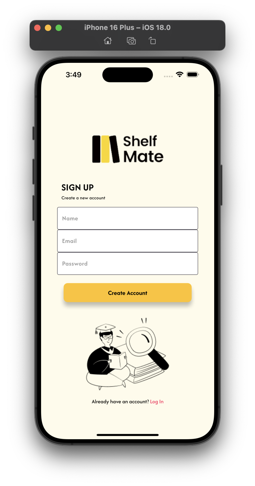
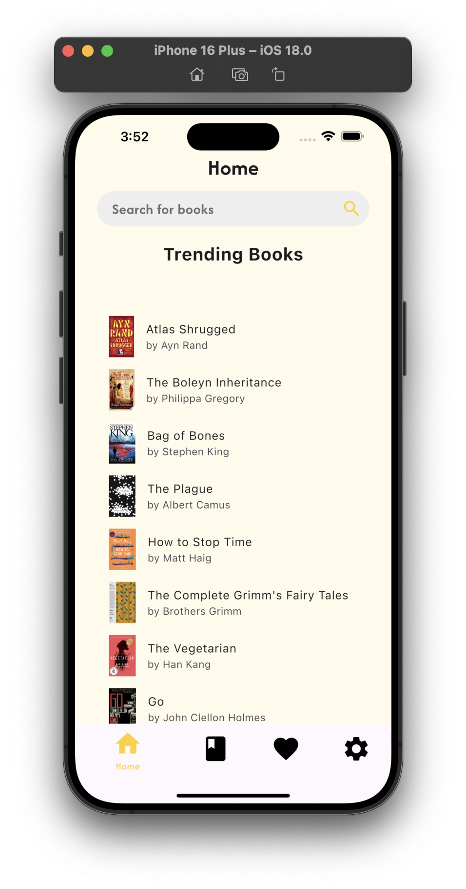
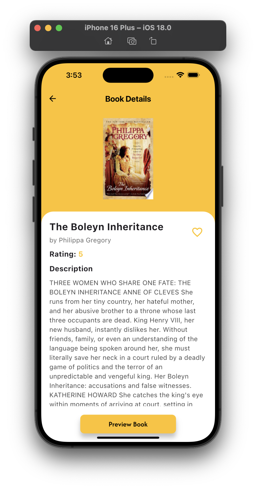
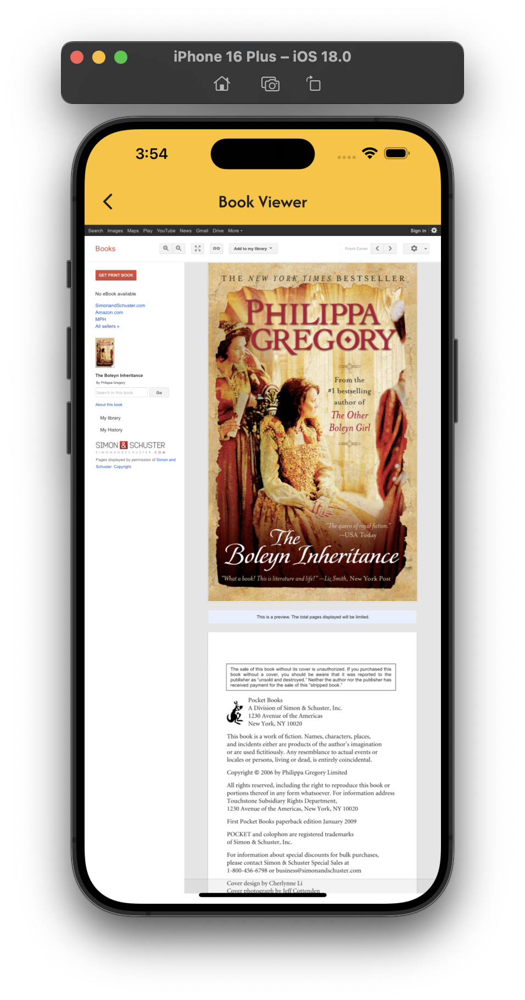
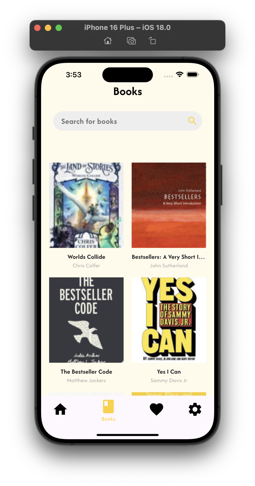
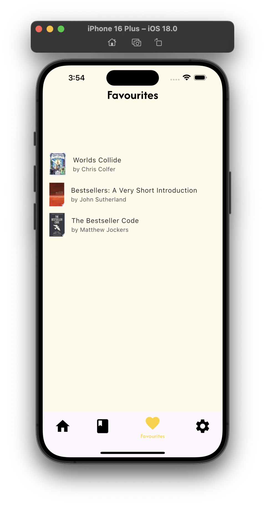
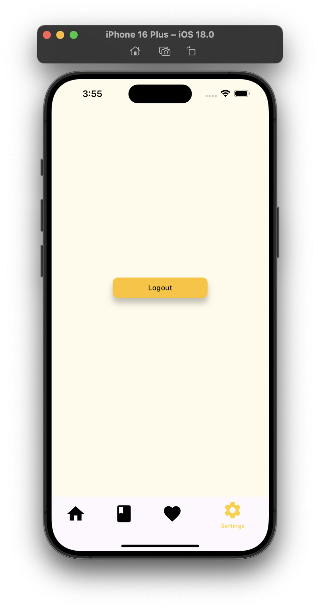

# INTERNATIONAL ISLAMIC UNIVERSITY MALAYSIA
## KULLIYYAH OF INFORMATION COMMUNICATION TECHNOLOGY
### CSCI 4311 | MOBILE APPLICATION DEVELOPMENT | SECTION 1
### SEMESTER 1, 2024/2025
## Virtual Library: ShelfMate

### By Group: XBT

---

## **Group Members**

| Name                                   | Matric ID  |  
|----------------------------------------|------------|  
| **Nor Aiman Zaharin Bin Noor Azwan**   | 2115931    |  
| **Muhammad Zulhazmi Rafiqi Azhary**    | 2116207    |  
| **Muhammad Syafiy Bin Abdul Rahman**   | 2115569    |  

---

## **Project Summary**

**Virtual Library: ShelfMate** is a mobile application designed to provide users with an interactive and accessible platform to explore, manage, and discover books efficiently. The app integrates various functionalities such as book search, personalized reading lists, and a seamless user experience powered by Flutter. Users can browse book details, add favorites, and preview available books using APIs. With a responsive UI and Firebase authentication, the app ensures a secure and engaging experience for book enthusiasts.

---

## **Project Objectives**

1. **Efficient Use of Widgets**
    - Utilize Flutter’s widget-based architecture to create modular, reusable, and scalable UI components (e.g., book cards, navigation bars, buttons).

2. **Integration of HTTP Library for Data Fetching**
    - Implement the HTTP package to fetch book data, images, and other relevant information from an external API, ensuring real-time updates.  <link> https://developers.google.com/books/docs/overview </link>

3. **Authentication System with Firebase/API**
    - Set up Firebase Authentication or an API-driven authentication system to manage user sign-ups, logins, and account security.

4. **Proper Page Routing and Navigation**
    - Implement structured navigation using Flutter’s `Navigator` system for smooth transitions between pages (home, book details, favourites, etc.).

5. **Responsive and Well-Designed Layouts**
    - Use Flutter’s layout widgets (`Column`, `Row`, `Expanded`, `Flexible`, `Stack`) to ensure proper UI alignment, responsiveness, and a seamless user experience across different screen sizes.

---

## **Compilation and Running Instructions**

### **1. Prerequisites**
Before running the project, ensure that you have the following installed:
- [Flutter SDK](https://flutter.dev/docs/get-started/install) (Version: `3.24.3` • Channel: `stable` • [GitHub](https://github.com/flutter/flutter.git))
- Framework Revision: `2663184aa7` (5 months ago) • `2024-09-11 16:27:48 -0500`
- Engine Revision: `36335019a8`
- Tools:
    - Dart `3.5.3`
    - DevTools `2.37.3`
- [Android Studio](https://developer.android.com/studio) or [Visual Studio Code](https://code.visualstudio.com/) with Flutter and Dart extensions.
- A physical Android/iOS device or an emulator (Android Emulator or iOS Simulator).
- Firebase account (if using Firebase Authentication).

### **2. Clone the Repository**
```bash
git clone [https://github.com/syafiyft/virtual-library-shelf-mate-MAD.git]
cd Virtual-Library-ShelfMate
```

### **3. Install Dependencies**
```bash
flutter pub get
```

### **4. Configure Firebase**
#### **For iOS**
1. Enable Firebase for iOS in the [Firebase Console](https://console.firebase.google.com/).
2. Register the iOS bundle identifier.
3. Download the `GoogleService-Info.plist` file and place it inside `ios/Runner/`.

### **5. Run the Application**
#### **Using an Emulator or Connected Device**
```bash
flutter run
```

#### **For iOS**
```bash
cd ios
pod install
cd ..
flutter run --release
```

### **6. Building for iOS**
```bash
flutter build ios --release
```
Ensure Xcode is installed and configured properly.

### **7. Troubleshooting**
```bash
flutter doctor
```
This command will check for missing dependencies and suggest fixes.

### **8. Cocoapods installation**
```bash
cd ios && arch -x86_64 pod install
```

---

## **Snapshots of the Application Running, and Explanation of the Flow of the App**

The **Virtual Library: ShelfMate** app follows a structured and user-friendly flow to ensure smooth navigation and accessibility. Below is the step-by-step flow of the app:

1. **Splash Screen → Authentication Page**

<p align="center">
  
  
  
</p>

- When the user launches the app, they are greeted with a **Splash Screen** displaying the app logo.
- After a brief delay, the app navigates to the **Authentication Page**, where users can:
    - **Sign Up** for a new account.
    - **Log In** using Firebase Authentication or an API-based authentication system.
    - **Upon creating a new password, it must be at least 7 characters.**
    - **You may use the provided email and password to test the login function. Email: zulhzmi27@gmail.com Password: 1234567**

<br>

2. **Home Page**

<p align="center">
  
</p>

- After logging in, users are directed to the **Home Page**, which serves as the main dashboard.
- The Home Page includes:
    - The books that are currently trending.
    - **Search Bar** – Allows users to search for books by title or keyword.
    - **Navigation Bar** – Provides access to different sections of the app (Home, Books, Favourites, Settings).

<br>

3. **Book Details Page → Preview Book Page**

<p align="center">
  
   
</p>

- When a user selects a book from the Home Page, they are directed to the **Book Details Page**.
- This page displays:
    - **Book Cover Image**
    - **Book Title & Author**
    - **Description of the book**
    - **Rating of the book**
    - **“Preview Book” Button** – This will redirect to the preview link of the selected book. Please note that only selected books are available for preview; not all books offer this option.
    - **Favorite Button** – Allows users to save books to their personal collection.

<br>

4. **Books Page**

<p align="center">
  
</p>

- This page displays random books from the API.

<br>

5. **Favourites Page (Saved Books)**

<p align="center">
  
</p>

- This page contains books that the user has:
    - **Added to Favorites** for quick access.
- Users can remove books (unfavourite) if needed.

<br>

6. **Settings Page**

<p align="center">
  
</p>

- Users can access the page to:
    - **Log out**

<br>
